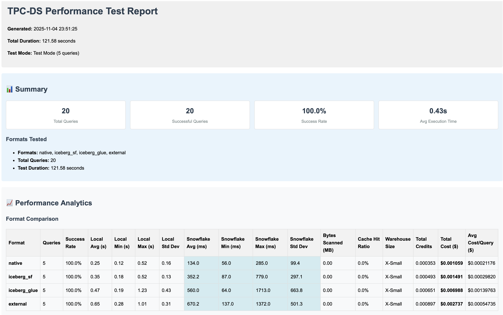

# Snowflake Iceberg Performance Testing Suite

A comprehensive performance testing framework for comparing 4 different Snowflake table formats using the TPC-DS benchmark:

1. **Native Snowflake Tables** - Standard Snowflake managed tables
2. **Iceberg Snowflake-Managed** - Iceberg format with Snowflake catalog
3. **Iceberg AWS Glue-Managed** - Iceberg format with external AWS Glue catalog
4. **External Tables** - External tables pointing to parquet data

## Table of Contents

- [Features](#features)
- [Project Structure](#project-structure)
- [Prerequisites](#prerequisites)
- [Setup Instructions](#setup-instructions)
- [Running Performance Tests](#running-performance-tests)
- [Understanding Results](#understanding-results)
- [Cost Optimization](#cost-optimization)
- [TPC-DS Schema](#tpc-ds-schema)
- [Verification](#verification)
- [Troubleshooting](#troubleshooting)
- [Cleanup](#cleanup)
- [Documentation](#documentation)
- [Configuration](#configuration)

## Features

- **TPC-DS Benchmark Testing**: 99 standard TPC-DS queries across all formats
- **Automated Test Execution**: Python framework with comprehensive metrics collection
- **Multiple Table Formats**: Native, Iceberg (Snowflake), Iceberg (Glue), External
- **Performance Analytics**: Detailed metrics, statistical analysis, and recommendations
- **Scalable Testing**: Support for multiple TPC-DS scale factors (0.01, 0.1, 1.0, etc.)
- **Automated Reporting**: HTML, JSON, CSV, and PDF report generation
- **Complete Setup Workflow**: Automated infrastructure and data loading

## Project Structure

```
iceberg-performance-benchmark/
├── setup/              # Setup functionality (infrastructure, schemas, glue, data)
├── benchmark/          # Performance testing framework
├── config/             # Global configuration files
├── lib/                # Shared utility modules
├── data/               # TPC-DS generated data (gitignored)
└── results/            # Test results and reports (gitignored)
```

See component READMEs for detailed structure: [`setup/README.md`](setup/README.md), [`benchmark/README.md`](benchmark/README.md)

## Prerequisites

- **Python 3.8+** with dependencies: `pip install -r requirements.txt`
- **Snowflake account** with ACCOUNTADMIN role, warehouse, and permissions for external volumes/catalog integrations
- **AWS account** (for Glue catalog and S3) - S3 bucket, Glue catalog access, IAM roles
- **Terraform** (for AWS infrastructure setup)
- **Spark** (for Glue table creation, if using Iceberg Glue format)

## Setup Instructions

**Quick Start:**
1. Clone repository and install dependencies: `pip install -r requirements.txt`
2. Configure environment variables: `cp env.example .env` and edit with your credentials
3. Set up AWS infrastructure, create Snowflake schemas, and load test data

See **[Setup Guide](setup/README.md)** for complete step-by-step instructions including:
- Environment variable configuration
- AWS infrastructure setup (Terraform)
- Snowflake schema creation
- Glue table setup (Iceberg Glue format)
- TPC-DS data generation and loading

## Running Performance Tests

### Quick Start

#### Quick Test (Test Mode - Limited Queries)

```bash
python benchmark/src/main.py --test-mode
```

#### Standard Test (All Formats, All Queries)

```bash
python benchmark/src/main.py
```

#### Test Specific Formats

```bash
python benchmark/src/main.py --formats native iceberg_sf
```

#### Test Query Range

```bash
python benchmark/src/main.py --query-range 1 10
```

### TPC-DS Query Categories

The benchmark includes 99 TPC-DS queries organized into 4 categories: Reporting (1-20), Ad-hoc (21-40), Iterative (41-60), and Data Mining (61-99).

See **[Benchmark Testing](benchmark/README.md)** for detailed query descriptions, query index, complexity levels, and format-specific optimizations.

### Configuration

Edit `benchmark/config/perf_test_config.yaml` to customize:

- Test modes (quick, standard, comprehensive, stress)
- Performance thresholds
- Reporting options
- Query execution settings

### Test Output

Results are saved to:

- `results/` - JSON and CSV results
- `results/reports/` - HTML reports with charts

See [`benchmark/README.md`](benchmark/README.md) for detailed testing documentation.

## Understanding Results

### Performance Metrics

- **Execution Time**: Query execution duration
- **Data Scanned**: Bytes of data scanned
- **Rows Produced**: Number of rows returned
- **Cache Hit Ratio**: Percentage of data served from cache
- **Credits Used**: Snowflake compute credits consumed
- **Memory Usage**: Peak memory consumption

### Format Comparison

The framework compares performance across 4 table formats:

- **Native Snowflake**: Baseline performance, fully managed
- **Iceberg (Snowflake)**: ACID transactions, time travel, versioning
- **Iceberg (Glue)**: Cross-platform compatibility, AWS ecosystem integration
- **External Iceberg**: Cost-effective, direct S3 access

### Reports

The framework generates comprehensive reports:

- **HTML Reports**: Interactive charts and visualizations
  - [View Example Report](docs/example-report.html) - Sample HTML report with performance metrics, cost analysis, and format comparisons
  - 
- **JSON Reports**: Machine-readable results for further analysis
- **CSV Exports**: Spreadsheet-compatible data
- **Statistical Analysis**: ANOVA, correlation analysis, trend detection

## Cost Optimization

The framework tracks costs across all components (Snowflake compute/storage, AWS S3, Glue, data transfer) and provides:
- Automatic cost calculation per query
- Cost comparison across formats
- Cost-performance analysis
- Optimization recommendations

See [Cost Optimization Guide](docs/cost-optimization-guide.md) for detailed guidance.

## TPC-DS Schema

24 tables (17 dimension, 7 fact) created in all 4 formats. See [`setup/schemas/`](setup/schemas/) for DDL scripts.

## Verification

**Query Row Counts for All Tables:**

To check row counts across all schemas and tables:

```bash
set -a && source .env && set +a && python setup/data/query_all_tables.py
```

This will display row counts for all tables in all 4 formats (native, iceberg_sf, iceberg_glue, external). You can also output to CSV:

```bash
set -a && source .env && set +a && python setup/data/query_all_tables.py --output csv
```

## Troubleshooting

**Quick Connection Test:**
```bash
python -c "from benchmark.src.query_engine import QueryEngine; q = QueryEngine(); print('Connected:', q.test_connection())"
```

**Common Issues:**
- **Permissions**: Ensure ACCOUNTADMIN role, AWS IAM permissions, S3 access
- **Environment Variables**: Verify `.env` is loaded (`set -a && source .env && set +a`)
- **Glue Tables**: Verify tables exist in Glue catalog before creating Snowflake references
- **Data Loading**: Check data files exist, Parquet compatibility, warehouse size

For detailed troubleshooting, see:
- **[Setup Guide](setup/README.md#troubleshooting)** - Setup and configuration issues
- **[Glue Integration Journey](docs/glue-integration-journey.md)** - Glue-specific troubleshooting

## Cleanup

### AWS Resources

```bash
cd setup/infrastructure/
terraform destroy
```

For Glue tables only:
```bash
cd setup/glue/
python scripts/maintenance/cleanup_glue_tables.py
```

### Snowflake Resources

```sql
-- Drop entire database (removes all schemas and tables)
DROP DATABASE IF EXISTS tpcds_performance_test CASCADE;

-- Or drop individual schemas
DROP SCHEMA IF EXISTS TPCDS_NATIVE_FORMAT CASCADE;
DROP SCHEMA IF EXISTS TPCDS_ICEBERG_SF_FORMAT CASCADE;
DROP SCHEMA IF EXISTS TPCDS_ICEBERG_GLUE_FORMAT CASCADE;
DROP SCHEMA IF EXISTS TPCDS_EXTERNAL_FORMAT CASCADE;
```

See [Setup Guide](setup/README.md) for detailed cleanup procedures.

## Documentation

### Component Documentation

- **[Setup Guide](setup/README.md)** - Complete setup guide: infrastructure, schemas, Glue tables, and data loading
- **[Benchmark Testing](benchmark/README.md)** - Performance testing framework: query execution, metrics collection, analytics, and reporting
- **[Infrastructure Setup](setup/infrastructure/README.md)** - AWS infrastructure provisioning with Terraform and cross-account configuration

### Additional Resources

- **[Glue Integration Journey](docs/glue-integration-journey.md)** - Troubleshooting guide for Glue-managed Iceberg tables
- **[Glue Integration Fix](docs/glue-iceberg-snowflake-integration-fix.md)** - Technical fix documentation for Glue-managed Iceberg table integration issues
- **[Troubleshooting Journey](docs/troubleshooting-journey.md)** - Complete troubleshooting journey narrative covering all table formats
- **[Cost Optimization Guide](docs/cost-optimization-guide.md)** - Cost analysis, optimization strategies, and recommendations

## Configuration

Key configuration files:

- **Global Configuration**: `config/*.yaml` - Snowflake, AWS, and TPC-DS settings
- **Test Configuration**: `benchmark/config/*.yaml` - Performance test settings, thresholds, and reporting options
- **Glue Configuration**: `setup/glue/config/*.yaml` - Glue catalog and Spark settings
- **Environment Variables**: `.env` - Credentials and connection settings (see `env.example`)

For detailed configuration options, see:
- [Benchmark Testing Configuration](benchmark/README.md#configuration-reference) - Test modes, thresholds, and reporting
- [Setup Guide](setup/README.md) - Infrastructure and data loading configuration
- [Infrastructure Setup](setup/infrastructure/README.md) - Terraform variables and AWS settings
